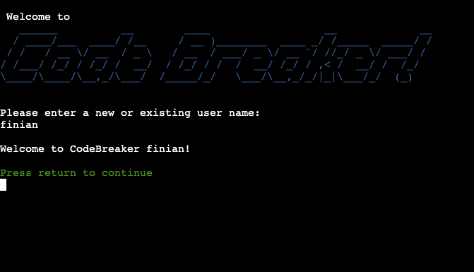
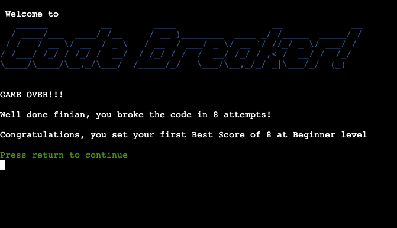

# Code Breaker Game

Link to [Github Repository](https://github.com/steve-doc/codebreaker)

Link to [Live site](https://the-code-breaker.herokuapp.com/)

## Index - Table of Contents
- [UX](#ux)

- [Features](#features)

- [Technology Used](#technology)

- [Testing](#testing)

- [Deployment](#deployment)

- [Credits](#credits)

## <a name="ux">UX</a>

### Strategy
Build a simple, fun and challenging codebreaking python console game that will engage the player. 

### Scope

1. Ask player for name and store best scores for future games
2. Offer 3 levels of game - Easy, Normal, Difficult - with 3, 4, and 5 digit random numerical codes respectively
3. Allow player to guess the code.
Provide feedback to player on whether the got the correct code or correct parts of the code. Then allow the player to refine their guess until completion.
4. Provide feedback to player on how they performed versus previous games.
5. Provide leaderboards for each level.

User stories
I want a game that is simple to play.
I want the game to be challenging to keep me engaged.
I want to be able to progress to more difficult levels.
I want simple instructions to understand the game.
I should be able to track and beat a high score.
I would like to see how I performe compared to other users.

### Structure

Simple game menu after initially asking for player name. 

Three difficuly levels to game. 

Game play is one screen where player will attempt guess code.  Can have as many guesses as required.  Feedback on each guess showing "Hits" (right number in right place)  and "Near Misses" (right number in wrong place).  Player refines guess in next attempt.

Google sheets used to store user scores for each level.

### Skeleton

The following flow chart was used to plan the game. 

### Surface

Due to the console/text nature of the game styling choices are limited.

Intruducted some color to the game by using escape codes on headings.  

To keep the game clean used console clear command when, for example, moving from menu to instructions and back.

## <a name="features">Features</a>

### Existing Features

1. Initial screen asking for player name.
    1. New player gets welcome screen. User is set up on scores spreadsheet.
    
    2. Existing player is welcomed back and is shown current Best Scores
    
2. Menu

3. Game play - shows hidden secret code and asks player to input guess. Feeds back on correct or incorrect guess with indication of how many digits were correct in right (Hit) or wrong (Near Miss) place. Will show historical guesses and feedback. No limit to amount of guesses.
After correct guess feeds back on score compared to previous score.

When game is over (player gets the code correct) their score is compared to their previous score and they get different feedback based on how the performed.  A different message is displayed depending whether they better, equalled or didn't beat their previous Best Score.  Also given a different message if it is their first scor on that level.

4. Instructions - Display detailed game instructions then return to main menu.

5. Leaderboard - Show 3 leaderboards, one for each game level.  Leaderboards are kept up to date with all players scores.  Only show top 10 scores, sorted by descending score.

6. Google Sheets API is used to score user scores.

### Future Features

1. Graphics - would like to investigate how to improve graphical appeal of the game.
2. Player validation - would like to impiment some better validation of user name to make sure each player is unique.  At present the game just accepts alphanumeric strings as player name. Problem would be if new player put in the name "Steve" for example, if there is already another user with "Steve" as their user name they will start playing as the existing user.

## <a name="technology">Technology Used</a>

1. Python - All code written in python
2. Github - For code repository and version control.
3. Gitpod - Cloud based 
4. Google Sheets API - Link to Google sheet to store player scores.
5. Heroku - To deploy live application

## <a name="testing">Testing</a>

### Code validated using [CI Python Linter](https://pep8ci.herokuapp.com/#)

I used [ASCII Art Generator](https://www.ascii-art-generator.org/) to generate multi line headings for the game and the instructions page.  

Have same issue with multi line instructions strings.
These are generating multiple PEP8 errors when run through [CI Python Linter](https://pep8ci.herokuapp.com/#).  These include "White Space", "Line too long" and "Invalid escape sequence" errors.  I couldn't resolve these errors without effecting the layout of the text.

These errors are limited to lines

### Browser Testing

#### Layout

Testing layout and appearance of game for consistency throughout browsers.

#### Functionality
- Testing complete functionality of the game. Includes
    - Game loads
    - Menu works
    - Game plays as expected 
    - Leaderboard updates
    - 3 different game levels work as expected
    - Instructions display correctly

| Browser     | Layout      | Functionality |
| :---------: | :----------:| :-----------: |
| Chrome      | ✔          | ✔             |
| Edge        | ✔          | ✔             |
| Firefox     | ✔          | ✔             |
| Safari      | ✔          | ✔             |

#### Testing User Stories

| Expectation   | Result    |
| :---------------------------------: | :------------------------------:|
| I want a game that is simple to play. | Test players had no issues understanding game |
| I want the game to be challenging to keep me engaged. | Game requires logic to complete and challenging enough even at easy level. Engagement enhanced by leaderboards as players can challenge themselves to beat other player's scores |
| I want to be able to progress to more difficult levels. | Game has option to choose 3 levels of difficulty with longer codes to break at each level |
| I want simple instructions to understand the game. | Game is simple enough to play without reading detailed instructions however the instructions can be accessed from main menu. |
| I should be able to track and beat a high score. | Best scores are recorded. Best scores are displayed when player logs on.  Player is updated at end of game if the beat/don't beat or equal their Best Score.  Also are given different message when they record their first score on each level. |
| I would like to see how I performe compared to other users. | Leaderboard provide top 10 scores for each level across all players. |

## Fixed Bugs
1. An error comparing string to int when check high scores only when new user "None" being high score. Discovered I had assigned wrong value to variable in another function. Resolved.
2. Heroku "Application error" in deployed code.  Was caused due to running out of Gitpod hours.  Have to create new workspace under CI Students Gitpod account and redeploy appplication.  Resloved.
## Bugs Unresolved
1. I used [ASCII Art Generator](https://www.ascii-art-generator.org/) to generate multi line headings for the game and the instructions page.  

Have same issue with multi line instructions strings.
These are generating multiple PEP8 errors when run through [CI Python Linter](https://pep8ci.herokuapp.com/#).  These include "White Space", "Line too long" and "Invalid escape sequence" errors.  I couldn't resolve these errors without effecting the layout of the text.

## <a name="deployment">Deployment</a>

This site was deployed via Heroku using the following steps:
1. Go to the Heroku Dashboard.
2. Click New.
3. Select to create a new app.
4. Add Config Var's for Creds and Port
5. Set the buildbacks to Python and NodeJS in that order.
6. Link the Heroku app to the repository.
7. Click on Deploy.

The link to the [live site](https://the-code-breaker.herokuapp.com/)

## <a name="credits">Credits</a>

### Code

* Used this stackoverflow thread to use lambda function to sort on list within a list - [Stackoverflow](https://stackoverflow.com/questions/4174941/how-to-sort-a-list-of-lists-by-a-specific-index-of-the-inner-list)

### Support
* My mentor Brian Macharia for some useful tips when reviewing my code.
* Alan Bushell, our CI Facilitator for his good humour and practical advise.

### Media
[ASCII Art Generator](https://www.ascii-art-generator.org/) used for generating more interesting headings